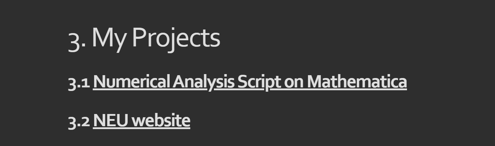
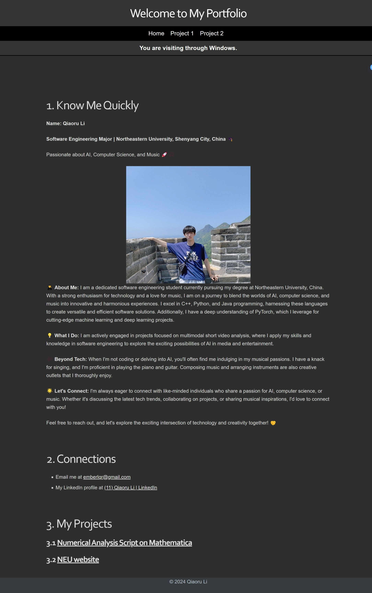
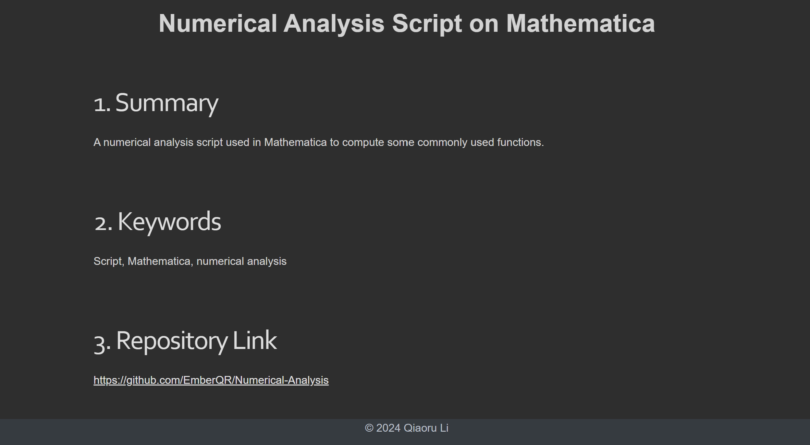

<div style="text-align: center; font-size: 42px; font-weight: bold;">
Explanations of Web Tutorial 2
</div>


# My Information

- Name: Qiaoru Li
- School ID: 20221939
- Class: International Class of Software Engineering

# Lab Steps

## Create JavaScript File and JSON

We create the `JavaScript` snippet in Pycharm with `Node.js` with the following code:

```js
// create Project class
class Project {
    constructor(title, summary, keywords, hyperlink) {
        this.title = title;
        this.summary = summary;
        this.keywords = keywords;
        this.hyperlink = hyperlink;
    }
}

// create Project object
const projects = [
    new Project(
        "Numerical Analysis Script on Mathematica",
        "A numerical analysis script used in Mathematica to compute some commonly used functions.",
        ["Script", "Mathematica", "numerical analysis"],
        "https://github.com/EmberQR/Numerical-Analysis"
    ),
    new Project(
        "NEU website",
        "A resource sharing website for Northeastern University (NEU)",
        ["website", "site", "resource", "sharing", "NEU"],
        "https://github.com/EmberQR/NEUsite"
    )
];

// convert to JSON
const projectsJson = JSON.stringify(projects, null, 2);

// write JSON to a file using the Node.js file system module
const fs = require('fs');
fs.writeFile('projects.json', projectsJson, 'utf8', (err) => {
    if (err) {
        console.error('Error writing JSON to file:', err);
    } else {
        console.log('JSON file has been saved.');
    }
});
```

Then we get the `JSON` file:

```json
[
  {
    "title": "Numerical Analysis Script on Mathematica",
    "summary": "A numerical analysis script used in Mathematica to compute some commonly used functions.",
    "keywords": [
      "Script",
      "Mathematica",
      "numerical analysis"
    ],
    "hyperlink": "https://github.com/EmberQR/Numerical-Analysis"
  },
  {
    "title": "NEU website",
    "summary": "A resource sharing website for Northeastern University (NEU)",
    "keywords": [
      "website",
      "site",
      "resource",
      "sharing",
      "NEU"
    ],
    "hyperlink": "https://github.com/EmberQR/NEUsite"
  }
]
```

## Load JSON file from web

### Main Page

Since my `index.html` file fetches the contents of `MainPage.html`, and the `fetch` function cannot directly run the JavaScript code on its target page, we define and call the `loadProjects` function on `index.html`, and read the project name and link from the JSON file.

In `MainPage.html`, project titles and hyperlinks are organized as follows:

```c++
<h2 id='numerical-analysis-script-on-mathematica'><a href='Project.html'><span>Numerical Analysis Script on Mathematica</span></a></h2>
```

Therefore we define the `loadProjects` function as follows:

```js
  function loadProjects() {
            fetch('projects.json')
                .then(response => {
                    if (!response.ok) {
                        throw new Error('Network response was not ok ' + response.statusText);
                    }
                    return response.json();
                })
                .then(data => {
                    const projectList = document.getElementById('project-list'); // Ensure this ID exists in MainpageContent.html
                    projectList.innerHTML = ''; // Clear previous contents if any

                    // Populate project data
                    data.forEach(project => {
                        const h2 = document.createElement('h2');
                        h2.id = project.title.toLowerCase().replace(/\s+/g, '-'); // Creating an ID from the title

                        const a = document.createElement('a');
                        a.href = project.hyperlink; // Set hyperlink
                        a.innerHTML = `<span>${project.title}</span>`; // Set title within span inside the hyperlink

                        h2.appendChild(a);
                        projectList.appendChild(h2);
                    });
                })
                .catch(error => console.error('Error loading the projects:', error));
}
```

We also change the `fetch('MainPage.html)` as follows:

```js
             // Fetch main page content HTML
    fetch('MainpageContent.html')
                .then(response => response.text())
                .then(data => {
                    // Insert the fetched content into the placeholder
                    document.getElementById('content-placeholder').innerHTML = data;

                    // After the content is loaded into the DOM, call loadProjects if it exists
                    if (typeof loadProjects === 'function') {
                        loadProjects();
                    } else {
                        console.error('loadProjects function is not defined.');
                    }
                })
                .catch(error => console.error('Error loading the main page content:', error));
```

The effect of Main Page is shown as follows:




### Project Detail Page

The `body` part of the project detail page is as follows:

```c++
<body class='typora-export os-windows'>
    <div class='typora-export-content'>
        <div id='write'  class=''>
            <div style="text-align: center; font-size: 36px; font-weight: bold;">这里替换为项目标题</div>
            <h1 id='summary'><span>Summary</span></h1>
            <p><span>这里替换为项目摘要</span></p>
            <h1 id='keywords'><span>Keywords</span></h1>
            <p><span>这里替换为项目关键词（注意正确处理数组）</span></p>
            <h1 id='repository-link'><span>Repository Link</span></h1>
            <p><a href="这里替换成仓库链接" target='_blank' class='url'>这里替换成仓库链接</a></p>
        </div>
    </div>
</body>
```

Therefore we define the `loadProjectsDetails` function as follows:

```js
      function loadProjectsDetails() {
            fetch('projects.json')
                .then(response => response.json())
                .then(data => {
                    // change 0 to other numbers
                    const project = data[0];

                    // Replace title
                    document.querySelector("div[style='text-align: center; font-size: 36px; font-weight: bold;']").textContent = project.title;

                    // Replace summary
                    document.querySelector("#summary + p span").textContent = project.summary;

                    // Replace keywords
                    document.querySelector("#keywords + p span").textContent = project.keywords.join(", ");

                    // Replace repository link
                    const repoLink = document.querySelector("#repository-link + p a");
                    repoLink.href = project.hyperlink;
                    repoLink.textContent = project.hyperlink;
                });
        }
```

As our `Project1.html` fetches `Project1Content.html`, we change the `fetch` logics:

```js
           // Fetch and insert content from Project1Content.html
            fetch('Project1Content.html')
                .then(response => response.text())
                .then(data => {
                    document.getElementById('content-placeholder').innerHTML = data;
                    loadProjectsDetails();
                });
```

The effects of `Project1.html` is shown below:



### Change page information

We use the following form to submit temporary changes:

```c++
    <div class="edit-area">
        <h2>Edit Project Details</h2>
        <label for="edit-title">Title:</label>
        <input type="text" id="edit-title">
        
        <label for="edit-summary">Summary:</label>
        <textarea id="edit-summary"></textarea>
        
        <label for="edit-keywords">Keywords (comma separated):</label>
        <input type="text" id="edit-keywords">
        
        <label for="edit-link">Repository Link:</label>
        <input type="text" id="edit-link">
        
        <button id="apply-changes">Apply Changes</button>
    </div>
```

`JavaScript` code:

```js
        function applyChanges() {
            const newTitle = document.getElementById('edit-title').value;
            const newSummary = document.getElementById('edit-summary').value;
            const newKeywords = document.getElementById('edit-keywords').value;
            const newLink = document.getElementById('edit-link').value;

            document.querySelector("div[style='text-align: center; font-size: 36px; font-weight: bold;']").textContent = newTitle;
            document.querySelector("#summary + p span").textContent = newSummary;
            document.querySelector("#keywords + p span").textContent = newKeywords;
            const repoLink = document.querySelector("#repository-link + p a");
            repoLink.href = newLink;
            repoLink.textContent = newLink;
        }
```

And we add some `CSS` styles:

```css
        .edit-area {
            width: 60%;
            margin: 20px auto;
            padding: 20px;
            background-color: #333;
            color: #fff;
            border-radius: 8px;
            box-shadow: 0 0 10px rgba(0, 0, 0, 0.1);
        }
        .edit-area h2 {
            text-align: center;
        }
        .edit-area label {
            display: block;
            margin-bottom: 5px;
        }
        .edit-area input, .edit-area textarea {
            width: 100%;
            margin-bottom: 10px;
            padding: 8px;
            border-radius: 4px;
            border: 1px solid #ccc;
        }
        .edit-area button {
            display: block;
            width: 50%;
            margin: 20px auto;
            padding: 10px 15px;
            background-color: #007bff;
            color: white;
            border: none;
            border-radius: 4px;
            cursor: pointer;
        }
```

The effect is shown below:


After submitting changes:

